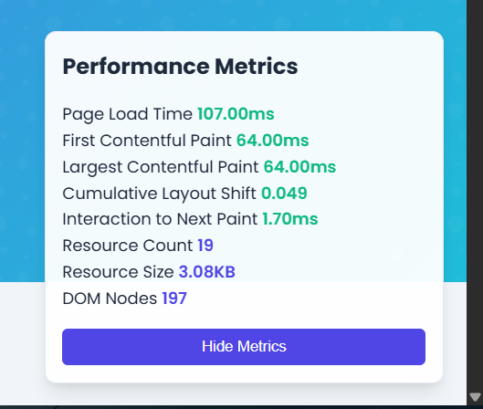

# Website TechSolutions dengan SEO dan Pemantauan Kinerja

## Deskripsi Proyek

Proyek ini mendemonstrasikan website perusahaan dengan implementasi SEO komprehensif dan alat pemantauan kinerja. Dirancang untuk memberikan pengalaman pengguna yang optimal sambil memaksimalkan visibilitas mesin pencari.

## Fitur Utama

- **Optimasi SEO Lengkap** - Implementasi praktik terbaik SEO
- **Pemantauan Kinerja Real-time** - Dasbor metrik kinerja interaktif
- **Desain Responsif** - Tampilan optimal di semua perangkat
- **Data Terstruktur** - Implementasi JSON-LD untuk hasil pencarian yang lebih kaya
- **Kode Bersih** - HTML semantik dan CSS yang efisien

## Implementasi SEO

Website ini mencakup optimasi SEO komprehensif:

### 1. Meta Tag 

| Elemen            | Deskripsi                            | Manfaat                                              |
| ----------------- | ------------------------------------ | ---------------------------------------------------- |
| Tag Judul         | Dioptimalkan dengan kata kunci utama | Meningkatkan CTR di hasil pencarian                  |
| Deskripsi Meta    | Proposisi nilai yang jelas           | Memberikan konteks kepada pengguna dan mesin pencari |
| Tag Kata Kunci    | Kata kunci relevan                   | Memberikan sinyal tambahan ke mesin pencari          |
| Informasi Penulis | Kredensial penulis                   | Meningkatkan kepercayaan dan otoritas                |

### 2. Struktur HTML Semantik 

- Hierarki heading yang tepat (H1, H2, H3)
- Elemen HTML5 semantik (header, nav, main, section, footer)
- Teks jangkar deskriptif untuk tautan

### 3. Optimasi Gambar 

- Teks alt untuk semua gambar dengan kata kunci deskriptif
- Atribut lebar dan tinggi untuk mencegah pergeseran tata letak
- Nama file deskriptif

### 4. Struktur URL 

- URL yang bersih dan deskriptif
- Pola URL yang konsisten

### 5. Data Terstruktur 

- Implementasi JSON-LD menggunakan kosakata Schema.org
- Skema Organisasi pada halaman beranda
- Skema AboutPage pada halaman tentang

### 6. SEO Teknis 

- File robots.txt dengan arahan yang tepat
- Sitemap XML dengan prioritas dan frekuensi perubahan
- URL kanonik untuk mencegah konten duplikat
- Desain responsif yang ramah seluler

### 7. Integrasi Media Sosial 

- Meta tag Open Graph untuk Facebook
- Meta tag Twitter Card

## Pemantauan Kinerja

<p align="center">
  
</p>

Website ini mencakup sistem pemantauan kinerja kustom yang melacak metrik berikut:

### Core Web Vitals

| Metrik      | Deskripsi                                   | Target      | Dampak                  |
| ----------- | ------------------------------------------- | ----------- | ----------------------- |
| **LCP**     | Largest Contentful Paint                    | < 2.5 detik | Persepsi kecepatan muat |
| **FID/INP** | First Input Delay/Interaction to Next Paint | < 200ms     | Responsivitas interaksi |
| **CLS**     | Cumulative Layout Shift                     | < 0.1       | Stabilitas visual       |

### Metrik Tambahan

- **Waktu Muat Halaman** - Mengukur total waktu yang diperlukan halaman untuk dimuat sepenuhnya
- **First Contentful Paint (FCP)** - Melacak kapan konten pertama dirender di layar
- **Jumlah dan ukuran sumber daya** - Melacak efisiensi penggunaan sumber daya
- **Jumlah node DOM** - Mengukur kompleksitas halaman

## Peningkatan Kinerja

Website ini mencakup beberapa optimasi kinerja:

<div align="center">

| Kategori       | Teknik                                 | Manfaat                              |
| -------------- | -------------------------------------- | ------------------------------------ |
| **JavaScript** | Pemuatan yang ditunda dengan `defer`   | Tidak memblokir rendering            |
| **CSS**        | CSS kritis disematkan                  | Rendering awal yang lebih cepat      |
| **Gambar**     | Dimensi yang ditentukan & lazy loading | Mengurangi CLS & menghemat bandwidth |
| **Dependensi** | Kode ringan tanpa framework berat      | Waktu muat yang lebih cepat          |
| **Animasi**    | Transisi CSS & akselerasi hardware     | Performa yang lebih baik             |

</div>

## Cara Penggunaan

```bash
# Kloning repositori
git clone https://github.com/122140155-rustian-afencius/techsolutions-website.git

# Masuk ke direktori proyek
cd techsolutions-website

# Buka di browser
# Buka index.html di browser Anda
```

1. Kloning repositori ini
2. Buka `index.html` di browser Anda
3. Lihat metrik kinerja di dasbor di pojok kanan bawah
4. Periksa kode sumber halaman untuk melihat implementasi SEO

## Analisis Kinerja

<p align="center">
  
</p>

Alat pemantauan kinerja menyediakan metrik real-time yang dapat digunakan untuk:

1. Menetapkan kinerja dasar
2. Mengidentifikasi hambatan
3. Mengukur dampak optimasi
4. Memastikan kinerja memenuhi harapan pengguna

## Peningkatan di Masa Depan

Area potensial untuk optimasi lebih lanjut:

- Menerapkan kompresi gambar dan format WebP
- Menambahkan service worker untuk kemampuan offline
- Menerapkan rendering sisi server untuk pemuatan awal yang lebih cepat
- Menambahkan dukungan HTTP/2 untuk pemuatan sumber daya yang lebih efisien
- Menerapkan ekstraksi CSS kritis

## Dokumentasi Tambahan

- [Analisis Kinerja](performance-analysis.md) - Analisis mendalam tentang metrik kinerja
- [Analisis SEO](seo-analysis.md) - Detail implementasi SEO
